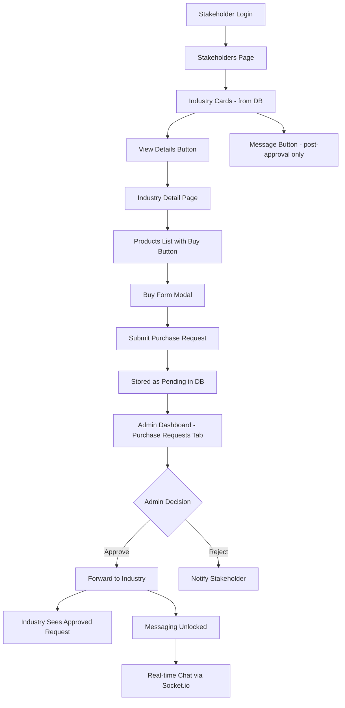
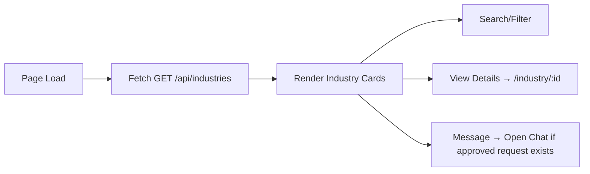
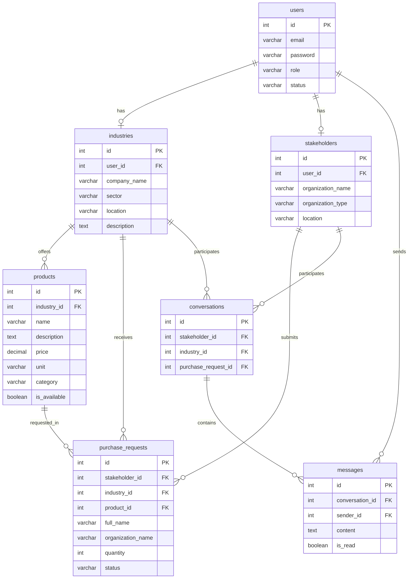

# EthioBridge — Full Feature Implementation Plan

## Current State Summary

### Existing Database Tables
- **`users`** — id, email, password, role (industry/stakeholder), status (incomplete/pending/approved/rejected)
- **`industries`** — id, user_id→users, company_name, sector, location, description, phone, website, established_year
- **`stakeholders`** — id, user_id→users, organization_name, organization_type, location, description, phone, contact_person

### Existing Backend Routes
- [`POST /api/signup`](backend/src/routes/auth.js:8) — User registration
- [`POST /api/login`](backend/src/routes/auth.js:44) — User login (returns JWT token)
- [`POST /api/profile/industry`](backend/src/routes/auth.js:88) — Submit industry profile
- [`POST /api/profile/stakeholder`](backend/src/routes/auth.js:131) — Submit stakeholder profile
- [`POST /api/admin/login`](backend/src/routes/admin.js:7) — Admin login
- [`GET /api/admin/pending`](backend/src/routes/admin.js:20) — Get pending users
- [`GET /api/admin/users`](backend/src/routes/admin.js:45) — Get all users
- [`PATCH /api/admin/users/:id/approve`](backend/src/routes/admin.js:65) — Approve user
- [`PATCH /api/admin/users/:id/reject`](backend/src/routes/admin.js:101) — Reject user

### Existing Frontend Pages
- [`Home.jsx`](frontend/src/pages/Home.jsx) — Landing page
- [`SignUp.jsx`](frontend/src/pages/SignUp.jsx) — Registration with role selection
- [`Login.jsx`](frontend/src/pages/Login.jsx) — Login + redirect by role/status
- [`IndustryProfile.jsx`](frontend/src/pages/IndustryProfile.jsx) — Profile completion form (post-signup)
- [`StakeholderProfile.jsx`](frontend/src/pages/StakeholderProfile.jsx) — Profile completion form (post-signup)
- [`PendingApproval.jsx`](frontend/src/pages/PendingApproval.jsx) — Waiting page after profile submitted
- [`Industry.jsx`](frontend/src/pages/Industry.jsx) — Industry dashboard (profile mgmt, placeholder products section)
- [`Stakeholders.jsx`](frontend/src/pages/Stakeholders.jsx) — Stakeholder page with **hardcoded** industry cards + chat sidebar
- [`AdminDashboard.jsx`](frontend/src/pages/AdminDashboard.jsx) — Admin panel (pending/all users, approve/reject)

### Key Issues to Address
1. [`Stakeholders.jsx`](frontend/src/pages/Stakeholders.jsx:30) uses hardcoded industry array — needs real DB data
2. Admin routes in [`admin.js`](backend/src/routes/admin.js) are not mounted in [`server.js`](backend/src/server.js) — needs `app.use("/api/admin", adminRoutes)`
3. No JWT auth middleware exists — routes are unprotected
4. No products, purchase_requests, or messages tables exist
5. No Socket.io for real-time messaging

---

## Architecture Overview



---

## Phase 1: Database Schema Changes

### New Tables to Add to [`schema.sql`](database/schema.sql)

#### `products` table
```sql
CREATE TABLE IF NOT EXISTS products (
  id SERIAL PRIMARY KEY,
  industry_id INTEGER NOT NULL REFERENCES industries(id) ON DELETE CASCADE,
  name VARCHAR(255) NOT NULL,
  description TEXT,
  price DECIMAL(12, 2),
  unit VARCHAR(50) DEFAULT 'unit',        -- e.g. 'kg', 'ton', 'piece', 'bag'
  category VARCHAR(255),
  image_url TEXT,
  is_available BOOLEAN DEFAULT true,
  created_at TIMESTAMP DEFAULT NOW(),
  updated_at TIMESTAMP DEFAULT NOW()
);
```

#### `purchase_requests` table
```sql
CREATE TABLE IF NOT EXISTS purchase_requests (
  id SERIAL PRIMARY KEY,
  stakeholder_id INTEGER NOT NULL REFERENCES stakeholders(id) ON DELETE CASCADE,
  industry_id INTEGER NOT NULL REFERENCES industries(id) ON DELETE CASCADE,
  product_id INTEGER NOT NULL REFERENCES products(id) ON DELETE CASCADE,
  full_name VARCHAR(255) NOT NULL,
  organization_name VARCHAR(255) NOT NULL,
  phone VARCHAR(50) NOT NULL,
  location VARCHAR(255) NOT NULL,
  quantity INTEGER NOT NULL,
  business_license TEXT,                    -- optional license/verification info
  notes TEXT,
  status VARCHAR(50) NOT NULL DEFAULT 'pending'
    CHECK (status IN ('pending', 'approved', 'rejected')),
  admin_notes TEXT,                         -- admin can add reason
  created_at TIMESTAMP DEFAULT NOW(),
  updated_at TIMESTAMP DEFAULT NOW()
);
```

#### `conversations` table
```sql
CREATE TABLE IF NOT EXISTS conversations (
  id SERIAL PRIMARY KEY,
  stakeholder_id INTEGER NOT NULL REFERENCES stakeholders(id) ON DELETE CASCADE,
  industry_id INTEGER NOT NULL REFERENCES industries(id) ON DELETE CASCADE,
  purchase_request_id INTEGER REFERENCES purchase_requests(id) ON DELETE SET NULL,
  created_at TIMESTAMP DEFAULT NOW(),
  UNIQUE(stakeholder_id, industry_id)      -- one conversation per pair
);
```

#### `messages` table
```sql
CREATE TABLE IF NOT EXISTS messages (
  id SERIAL PRIMARY KEY,
  conversation_id INTEGER NOT NULL REFERENCES conversations(id) ON DELETE CASCADE,
  sender_id INTEGER NOT NULL REFERENCES users(id) ON DELETE CASCADE,
  content TEXT NOT NULL,
  file_url TEXT,
  file_name VARCHAR(255),
  is_read BOOLEAN DEFAULT false,
  created_at TIMESTAMP DEFAULT NOW()
);
```

### Migration File
Create [`database/migrations/002_add_products_requests_messages.sql`](database/migrations/002_add_products_requests_messages.sql) with the above SQL.

---

## Phase 2: JWT Auth Middleware

Create [`backend/src/middleware/auth.js`](backend/src/middleware/auth.js):

```javascript
// Verifies JWT token from Authorization header
// Attaches user { id, email, role, status } to req.user
// Used to protect all non-public routes

function authenticateToken(req, res, next) { ... }
function requireRole(...roles) { ... }   // e.g. requireRole('industry')
function requireApproved(req, res, next) { ... } // checks status === 'approved'
```

**Three middleware functions:**
- `authenticateToken` — Decodes JWT, attaches `req.user`
- `requireRole('industry')` / `requireRole('stakeholder')` — Role-based gating
- `requireApproved` — Only approved users can access protected features

---

## Phase 3: Backend API Endpoints

### Products Routes — [`backend/src/routes/products.js`](backend/src/routes/products.js)

| Method | Path | Auth | Description |
|--------|------|------|-------------|
| `GET` | `/api/products/:industryId` | Public | Get all products for an industry |
| `POST` | `/api/products` | Industry (approved) | Create a product |
| `PUT` | `/api/products/:id` | Industry (owner) | Update a product |
| `DELETE` | `/api/products/:id` | Industry (owner) | Delete a product |
| `GET` | `/api/my-products` | Industry (approved) | Get own products |

### Industries Listing Routes — [`backend/src/routes/industries.js`](backend/src/routes/industries.js)

| Method | Path | Auth | Description |
|--------|------|------|-------------|
| `GET` | `/api/industries` | Stakeholder | List all approved industries |
| `GET` | `/api/industries/:id` | Stakeholder | Get detailed industry profile + products |

### Purchase Requests Routes — [`backend/src/routes/purchases.js`](backend/src/routes/purchases.js)

| Method | Path | Auth | Description |
|--------|------|------|-------------|
| `POST` | `/api/purchases` | Stakeholder (approved) | Submit a purchase request |
| `GET` | `/api/purchases/my-requests` | Stakeholder | View own purchase requests |
| `GET` | `/api/purchases/industry-requests` | Industry (approved) | View requests approved for this industry |
| `GET` | `/api/admin/purchases` | Admin | List all purchase requests (with filters) |
| `PATCH` | `/api/admin/purchases/:id/approve` | Admin | Approve a purchase request |
| `PATCH` | `/api/admin/purchases/:id/reject` | Admin | Reject a purchase request |

### Messaging Routes — [`backend/src/routes/messages.js`](backend/src/routes/messages.js)

| Method | Path | Auth | Description |
|--------|------|------|-------------|
| `GET` | `/api/conversations` | Authenticated | List all conversations for current user |
| `GET` | `/api/conversations/:id/messages` | Authenticated | Get messages in a conversation |
| `POST` | `/api/conversations/:id/messages` | Authenticated | Send a message (REST fallback) |

**Socket.io events** (real-time):
- `join_conversation` — User joins a conversation room
- `send_message` — Send message to conversation
- `new_message` — Broadcast to other participant
- `typing` / `stop_typing` — Typing indicators

### Mount new routes in [`server.js`](backend/src/server.js):

```javascript
const adminRoutes = require("./routes/admin.js");    // MISSING - needs to be added
const productRoutes = require("./routes/products.js");
const industryRoutes = require("./routes/industries.js");
const purchaseRoutes = require("./routes/purchases.js");
const messageRoutes = require("./routes/messages.js");

app.use("/api/admin", adminRoutes);
app.use("/api", productRoutes);
app.use("/api", industryRoutes);
app.use("/api", purchaseRoutes);
app.use("/api", messageRoutes);
```

### Socket.io Setup in [`server.js`](backend/src/server.js):

```javascript
const http = require("http");
const { Server } = require("socket.io");
const server = http.createServer(app);
const io = new Server(server, { cors: { origin: "*" } });
// ... socket event handlers
server.listen(PORT);  // instead of app.listen
```

---

## Phase 4: Frontend Component Structure

### New Pages/Components to Create

```
frontend/src/
  pages/
    IndustryDetailPage.jsx      — Full industry profile + products (stakeholder view)
    IndustryDetailPage.css
  components/
    BuyFormModal.jsx             — Purchase request form modal
    BuyFormModal.css
    ChatWindow.jsx               — Real-time messaging component (reusable)
    ChatWindow.css
    ProductCard.jsx              — Product display card
    ProductCard.css
    ProductForm.jsx              — Add/Edit product form (industry dashboard)
    ProductForm.css
```

### Files to Modify

| File | Changes |
|------|---------|
| [`App.js`](frontend/src/App.js) | Add route `/industry/:id` for IndustryDetailPage |
| [`Stakeholders.jsx`](frontend/src/pages/Stakeholders.jsx) | Replace hardcoded data with API fetch; add View Details button; integrate real messaging |
| [`Industry.jsx`](frontend/src/pages/Industry.jsx) | Implement product CRUD in "Manage Product Listings" section; add "Purchase Requests" section; implement messaging |
| [`AdminDashboard.jsx`](frontend/src/pages/AdminDashboard.jsx) | Add "Purchase Requests" tab with approve/reject actions |
| [`server.js`](backend/src/server.js) | Mount admin routes, new routes, Socket.io |

### Updated Route Map in [`App.js`](frontend/src/App.js):

```jsx
<Route path="/stakeholders" element={<Stakeholders />} />
<Route path="/industry/:id" element={<IndustryDetailPage />} />   // NEW
<Route path="/industry" element={<Industry />} />
```

---

## Phase 5: Detailed Component Behavior

### Stakeholders Page Flow



**Industry Card shows:**
- Company name, sector, location
- **View Details** button → navigates to `/industry/:id`
- **Message** button → opens chat sidebar (only if a conversation exists from an approved purchase)

### Industry Detail Page — `/industry/:id`

**Sections:**
1. Industry header: company_name, sector, location, description, phone, website, established_year
2. Products grid: each product shows name, description, price, unit, category
3. Each product has a **Buy** button → opens BuyFormModal

### Buy Form Modal

**Fields:**
- Full name (pre-filled from stakeholder profile)
- Organization name (pre-filled)
- Phone (pre-filled)
- Location (pre-filled)
- Product requested (auto-filled from clicked product, read-only)
- Quantity (number input)
- Business license / verification info (optional textarea)
- Additional notes (optional)

**On submit:** `POST /api/purchases` → shows success toast → status = pending

### Admin Dashboard — Purchase Requests Tab

**New sidebar button:** 📋 Purchase Requests

**Table view showing:**
- Request ID, Date
- Stakeholder name + organization
- Industry name
- Product name + quantity
- Status badge (pending/approved/rejected)
- Actions: Approve / Reject buttons (for pending)

**On Approve:**
- Updates status to approved
- Creates a conversation between stakeholder and industry (if not exists)
- The request becomes visible in the industry dashboard

### Industry Dashboard — Purchase Requests Section

**New menu item:** 📋 Purchase Requests (visible after approval)

Shows list of approved purchase requests with:
- Stakeholder name, organization, phone, location
- Product, quantity, notes
- **Message** button → opens chat with that stakeholder

### Real-time Messaging

**ChatWindow component** used in both:
- [`Stakeholders.jsx`](frontend/src/pages/Stakeholders.jsx) — sidebar chat
- [`Industry.jsx`](frontend/src/pages/Industry.jsx) — messages section

**Features:**
- Socket.io connection on mount
- Join conversation room
- Send/receive messages in real-time
- Text messages + file attachments
- Typing indicators
- Auto-scroll to latest message
- Message read status

---

## Phase 6: Backend Dependencies to Install

```bash
cd backend && npm install socket.io multer
```

- **`socket.io`** — Real-time messaging
- **`multer`** — File upload handling (for chat attachments and business license uploads)

## Phase 7: Frontend Dependencies to Install

```bash
cd frontend && npm install socket.io-client
```

---

## Execution Order Summary

| Phase | Scope | Description |
|-------|-------|-------------|
| 1 | Database | Create migration with products, purchase_requests, conversations, messages tables |
| 2 | Backend | Create JWT auth middleware (authenticateToken, requireRole, requireApproved) |
| 3 | Backend | Fix: Mount admin routes in server.js |
| 4 | Backend | Create products CRUD routes |
| 5 | Backend | Create industries listing routes (approved only) |
| 6 | Backend | Create purchase requests routes + admin purchase management |
| 7 | Backend | Setup Socket.io + create messaging routes |
| 8 | Frontend | Update Stakeholders.jsx: fetch real industries from DB, add View Details button |
| 9 | Frontend | Create IndustryDetailPage with products display |
| 10 | Frontend | Create BuyFormModal component |
| 11 | Frontend | Update Industry.jsx: Product CRUD management |
| 12 | Frontend | Update Industry.jsx: Purchase requests viewer |
| 13 | Frontend | Update AdminDashboard.jsx: Purchase requests tab |
| 14 | Frontend | Build ChatWindow component with Socket.io integration |
| 15 | Frontend | Integrate ChatWindow into Stakeholders.jsx and Industry.jsx |
| 16 | Full Stack | Integration testing and bug fixes |

---

## Entity Relationship Diagram



---

## Full Workflow Diagram

```mermaid
sequenceDiagram
    participant S as Stakeholder
    participant FE as Frontend
    participant BE as Backend API
    participant DB as PostgreSQL
    participant IO as Socket.io
    participant A as Admin
    participant I as Industry

    Note over S,I: Browse and Purchase Flow
    S->>FE: Visit /stakeholders
    FE->>BE: GET /api/industries
    BE->>DB: SELECT approved industries
    DB-->>BE: Industry list
    BE-->>FE: JSON response
    FE-->>S: Render industry cards

    S->>FE: Click View Details
    FE->>BE: GET /api/industries/:id
    BE->>DB: SELECT industry + products
    DB-->>BE: Detail data
    BE-->>FE: JSON response
    FE-->>S: Show detail page with products

    S->>FE: Click Buy on a product
    FE-->>S: Show BuyFormModal
    S->>FE: Fill form and submit
    FE->>BE: POST /api/purchases
    BE->>DB: INSERT purchase_request as pending
    DB-->>BE: Created
    BE-->>FE: Success
    FE-->>S: Purchase request submitted

    Note over A,DB: Admin Approval Flow
    A->>FE: View Purchase Requests tab
    FE->>BE: GET /api/admin/purchases
    BE->>DB: SELECT pending requests
    DB-->>BE: Requests list
    BE-->>FE: JSON response
    FE-->>A: Show requests table

    A->>FE: Click Approve
    FE->>BE: PATCH /api/admin/purchases/:id/approve
    BE->>DB: UPDATE status to approved
    BE->>DB: INSERT/GET conversation
    DB-->>BE: Done
    BE-->>FE: Approved
    FE-->>A: Updated status

    Note over S,I: Messaging Flow - after approval
    S->>FE: Open chat with industry
    FE->>IO: join_conversation
    S->>FE: Type message
    FE->>IO: send_message
    IO->>BE: Save to DB
    IO->>I: new_message broadcast
    I->>FE: Receives real-time message
